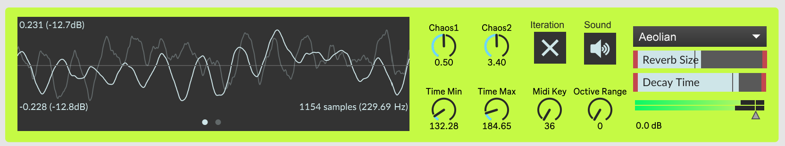

# Logistic Mapping for Ambient Generation

Using the **Logistic Map** to generate ambient music within a given music mode. For Logistic Map principles, see https://github.com/ponikii/MSP_Chaotic_FM.

## Parameters

### Chaos Level

- This program uses the output of a logistic map system to modulate how fast new sound generates.

- `Chaos1` stands for $x_{n}$ and `Chaos2` for $r$ in the system.

- `Toggle` to enable/disable system iteration.
- `Time min`  and  `Time max` controls the time interval of sound generation.

### Musical Range

- `Midi Key` determines the root note.
- Use `Octive Range` to add higher/lower frequencies.
- Use the drop down menu to change modes.

### Effects

- Reverb
- Chorus (not shown in the presentation interface)